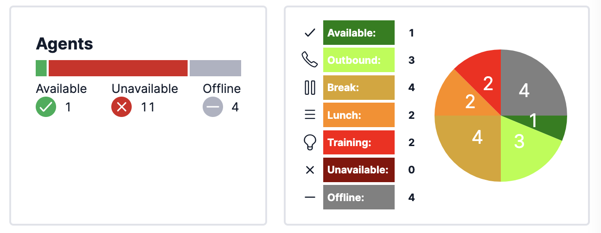

# Enhanced Flex Queues Dashboard

Twilio Flex Plugins allow you to customize the appearance and behavior of [Twilio Flex](https://www.twilio.com/flex). If you want to learn more about the capabilities and how to use the API, check out our [Flex documentation](https://www.twilio.com/docs/flex).


## How it works

This plugin contains a set of enhancements for the Real-Time Queues View.

- Filter Queues View by Agent's team_name attribute
- Manual filter to only display a "group" of queues (based on partial queue name match).
- Selectively remove a metric (waiting-tasks) based on the Queue Name
- Add Titles with Active/Waiting tasks aggregated for a set of queues (using Queue Name)  
- Add tiles with metrics aggregated by Channel

The Flex [Real-Time Queues View](https://www.twilio.com/docs/flex/end-user-guide/insights/real-time-queues-view) displays all queues unless you set a [filter](https://www.twilio.com/docs/flex/developer/ui/queues-view-programmability#setfilter) that hides or displays only some queues.

The [Queues Data Table](https://www.twilio.com/docs/flex/developer/ui/queues-view-programmability#modify-the-queuesdatatable) can be modifed by removing and (re)adding columns with metrics.

### Flex Queues View data
As you can see from [this example in our Flex documentation](https://www.twilio.com/docs/flex/developer/ui/queues-view-programmability#add-or-remove-individual-data-tiles), you can connect a custom Data Tile to the Flex Redux application store using [connect](https://react-redux.js.org/api/connect) from React-Redux. You need to provide the equivalent of a [mapStateToProps](https://react-redux.js.org/using-react-redux/connect-mapstate) function and return an object with props. Alternatively, in Flex v2 you can now leverage the [useFlexSelector](https://www.twilio.com/docs/flex/developer/ui/overview-of-flex-ui-programmability-options#useflexselector) wrapper method to extract the real time queues data from the Flex Redux store for use in a React component.

To better understand the queues data that is available in the Flex Redux store, you can either use the Redux Dev Tools in Chrome or use this command in the Chrome console to inspect the real-time Queue data in the Flex Redux store via the Flex Manager:

```
Twilio.Flex.Manager.getInstance().store.getState().flex.realtimeQueues
```

### Active and waiting tasks by channel Data Tiles
To be able to display the Active and Waiting Tasks for a specific Task Channel (e.g voice, chat, sms), we would first need to calculate these totals by aggregating the Channels data for all Queues. See code for this is contained in the `QueueDataUtil.getTaskCountsByChannel` method.  Leveraging the `getTaskCountsByChannel` utility method, we can create our custom Channel Data Tile component. This component is similar to the `AggregatedDataTile` component available in Flex with the a small enhancement to be able to change the tile background color:


### Channel SLA Data Tiles

The Flex Real Time Queues View shows the SLA % for each Queue (and further broken down by Channel, if available). If there are a large number of queues, it may be preferable to display the SLA % aggregated by Channel across all queues. The code for this aggregation is contained in the `QueueDataUtil.getSLTodayByChannel` method.  Leveraging this utility method, we can now create our custom Channel SLA Data Tiles:


### Custom pie chart Data Tiles
Since there is limited screen space at the top of the Queues View to add new Data Tiles, it may make sense to combine several SLA metrics into a single data tile. For example:


This pie chart Data Tile is just one possible visualization of this data. Other options include vertical bar charts or donut charts. There are a variety of chart libraries available in npm for inclusion in your plugin. 

### Queue Group Data Tile
Furthermore, for large Flex implementations with dozens or even 100s of Queues, it may make sense to aggregate the data across a group of related Queues and calculate the SLA % for this group of Queues.  To be able to aggregate the data across all Queues into groups, you would need to have a consistent Queue naming format where the `group` is a predetermined part of the queue name (for example <strong>sales</strong>.mobile.voice.en). Here is an example of what this could look like:


### Enhanced Agent Activity Breakdown Chart
The native Agent Activity Tile adds up all Unavailable activities into 1 category (Unavailable) and does not show the agent counts for each specific Unavailable activity (for example, Break, Training, Lunch etc).  The Workspace agent activity data can be aggregated by Activity to display this more granular breakdown.




### Teams View Data Tiles (Activity & Skills)

June 2023 Update.  This plugin now also includes sample code to add "Data Tiles" to the Flex [Teams View](https://www.twilio.com/docs/flex/end-user-guide/insights/monitor-agent-activity).  Using the Worker data in the Flex Redux store associated with the Teams View, we can aggregate Worker Activity data to show Worker Activity / Status by team (assuming the `team_name` attribute is populated).  Furthermore, we can differentiate agents in the Available activty that are truly *Idle* (have no tasks) or are Available but *Busy* (have at least 1 task)


Note: The Teams View can only display up to 200 agents, so the worker data available for aggregation is limited to this data set.

# Configuration

## Requirements

To deploy this plugin, you will need:

- An active Twilio account with Flex provisioned. Refer to the [Flex Quickstart](https://www.twilio.com/docs/flex/quickstart/flex-basics#sign-up-for-or-sign-in-to-twilio-and-create-a-new-flex-project%22) to create one.
- npm version 5.0.0 or later installed (type `npm -v` in your terminal to check)
- Node.js version 12 or later installed (type `node -v` in your terminal to check). We recommend the _even_ versions of Node.
- [Twilio CLI](https://www.twilio.com/docs/twilio-cli/quickstart#install-twilio-cli) along with the [Flex CLI Plugin](https://www.twilio.com/docs/twilio-cli/plugins#available-plugins) and the [Serverless Plugin](https://www.twilio.com/docs/twilio-cli/plugins#available-plugins). Run the following commands to install them:

```
# Install the Twilio CLI
npm install twilio-cli -g
# Install the Serverless and Flex as Plugins
twilio plugins:install @twilio-labs/plugin-serverless
twilio plugins:install @twilio-labs/plugin-flex
```

## Setup

Install the dependencies by running `npm install`:

```bash
cd plugin-dashboards
npm install

```
From the root directory, rename `public/appConfig.example.js` to `public/appConfig.js`.

```bash
mv public/appConfig.example.js public/appConfig.js
```


## Flex Plugin

### Development

Create the plugin config file by copying `.env.example` to `.env`.

```bash
cd plugin-dashboards
cp .env.example .env
```

To run the plugin locally, you can use the Twilio Flex CLI plugin. Using your command line, run the following from the root directory of the plugin.

```bash
cd plugin-dashboards
twilio flex:plugins:start
```

This will automatically start up the webpack dev server and open the browser for you. Your app will run on `http://localhost:3000`.

When you make changes to your code, the browser window will be automatically refreshed.


### Deploy your Flex Plugin

Once you are happy with your Flex plugin, you have to deploy then release it on your Flex application.

Run the following command to start the deployment:

```bash
twilio flex:plugins:deploy --major --changelog "Releasing Dashboards plugin" --description "Dashboards plugin"
```

After running the suggested next step, navigate to the [Plugins Dashboard](https://flex.twilio.com/admin/) to review your recently deployed plugin and confirm that it’s enabled for your contact center.

**Note:** Common packages like `React`, `ReactDOM`, `Redux` and `ReactRedux` are not bundled with the build because they are treated as external dependencies so the plugin will depend on Flex to provide them globally.

You are all set to test this plugin on your Flex application!

## License

[MIT](http://www.opensource.org/licenses/mit-license.html)

## Disclaimer

No warranty expressed or implied. Software is as is.


